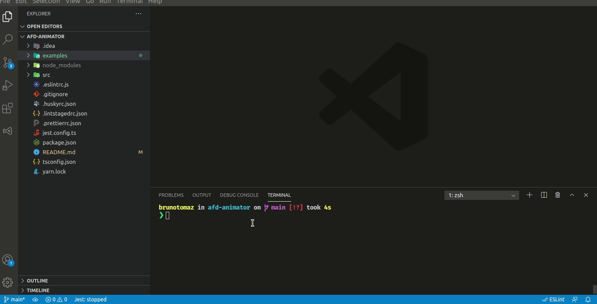
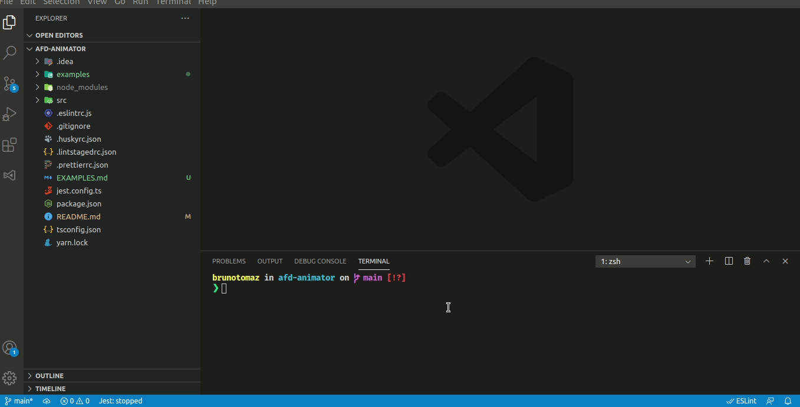
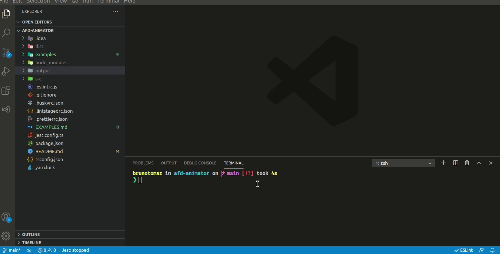

## Exemplos

## AFD Documento

## AFD quantidades pares de 0s e 1s

## AFD quantidades pares ou ímpares

## AFD palavra de tamanho três

## AFN com dois estados iniciais

## AFN com três estados iniciais

## AFN λ

## AFN λ

## AFN λ
