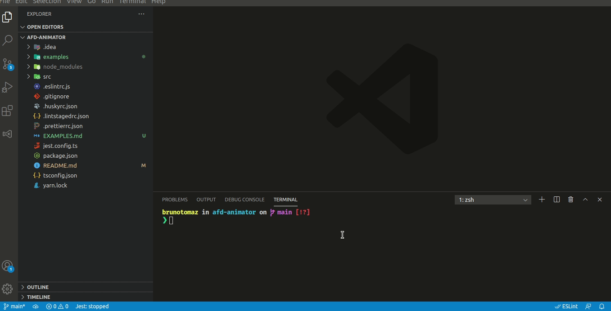
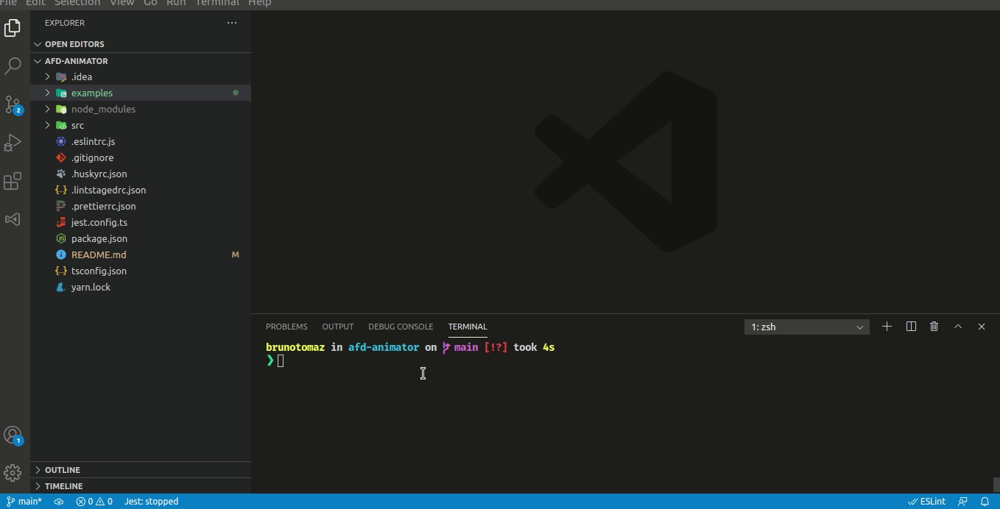

# afd-animator
Este projeto consiste na produção de uma quadro em cada estágio da configuração instantânea da máquina.

#### Instalação

1. Caso não tenha o `node` instalado em seu ambiente:
   `$ sudo apt install nodejs`  
   `$ sudo apt install npm`

2. Caso não tenha o `yarn` instalado em seu ambiente:
   `$ npm install -g yarn`

3. Clone o repositório e instale na sua máquina local:
   `$ git clone https://github.com/brTomaz/afd-animator.git`

4. Entre no diretório do projeto:
   `$ cd afd-animator`

5. Instale as dependências:
   `$ yarn install`

6. Faça o build do projeto:
   `$ yarn build`

7. Execute
   `$ yarn start <FILEPATH>` ou `$ yarn dev <FILEPATH>`

   As animações geradas na execução dos arquivos estarão em `output/animations`

## Exemplos

Navegue até o arquivo `EXAMPLES.md` e veja mais exemplos de execução.